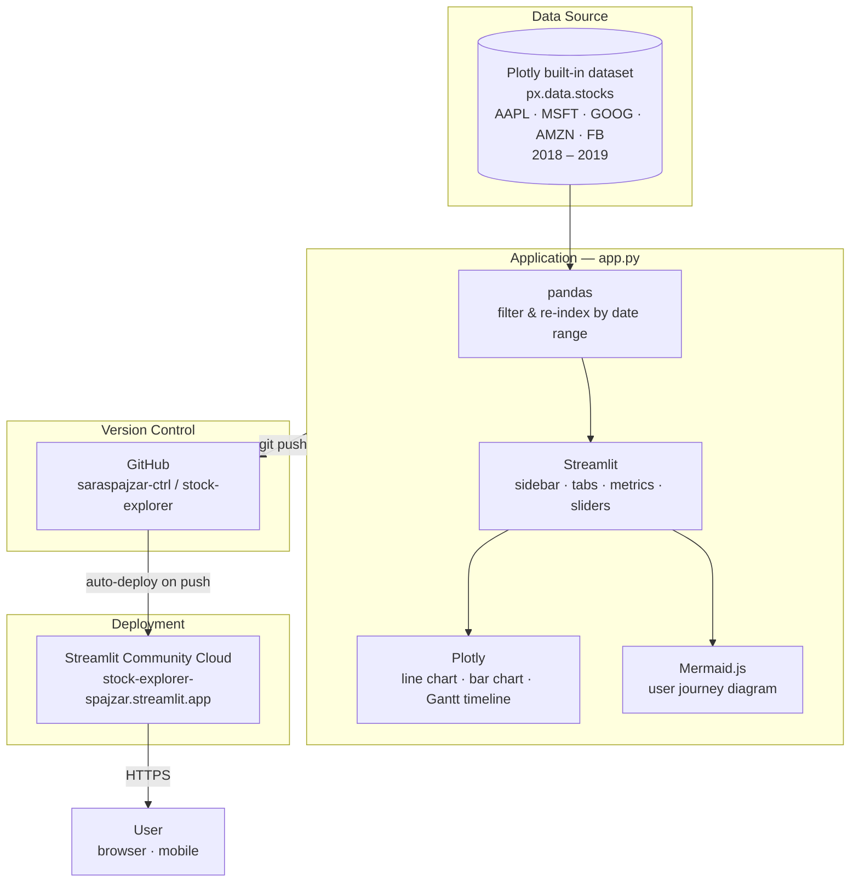

# Stock Price Explorer

An interactive Streamlit app for exploring historical stock performance, built with a warm-on-green design system and a mobile-first layout.

**Live app:** https://stock-explorer-spajzar.streamlit.app

---

## Features

- **Normalized price chart** — re-indexes all stocks to 1.00 at the start of the selected window so relative growth is instantly comparable
- **Date-range slider** — zoom into any sub-period within the 2018–2019 dataset
- **$1,000 investment calculator** — shows what a fixed amount would be worth today for any chosen stock
- **Volatility indicator** — highlights the most volatile stock using daily standard deviation
- **Total growth bar chart** — side-by-side percentage growth across all selected stocks
- **Market events Gantt chart** — Plotly timeline of Bear Market / Trade War / Recovery phases
- **User journey map** — Mermaid diagram tracing a typical analyst session through the app

---

## Architecture



---

## Running locally

```bash
# 1. Clone
git clone https://github.com/saraspajzar-ctrl/stock-explorer.git
cd stock-explorer

# 2. Install dependencies
pip install -r requirements.txt

# 3. Run
streamlit run app.py
```

The app opens at `http://localhost:8501`.

---

## Tech stack

| Layer | Tool |
|---|---|
| Data | Plotly built-in `px.data.stocks()` |
| Data wrangling | pandas |
| UI framework | Streamlit |
| Charts | Plotly (Scatter, Bar, timeline) |
| Diagrams | Mermaid.js v9 |
| Styling | CSS custom properties, mobile-first media queries |
| Deployment | Streamlit Community Cloud |
| Version control | Git / GitHub |
